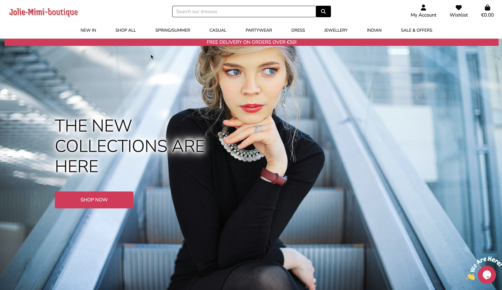
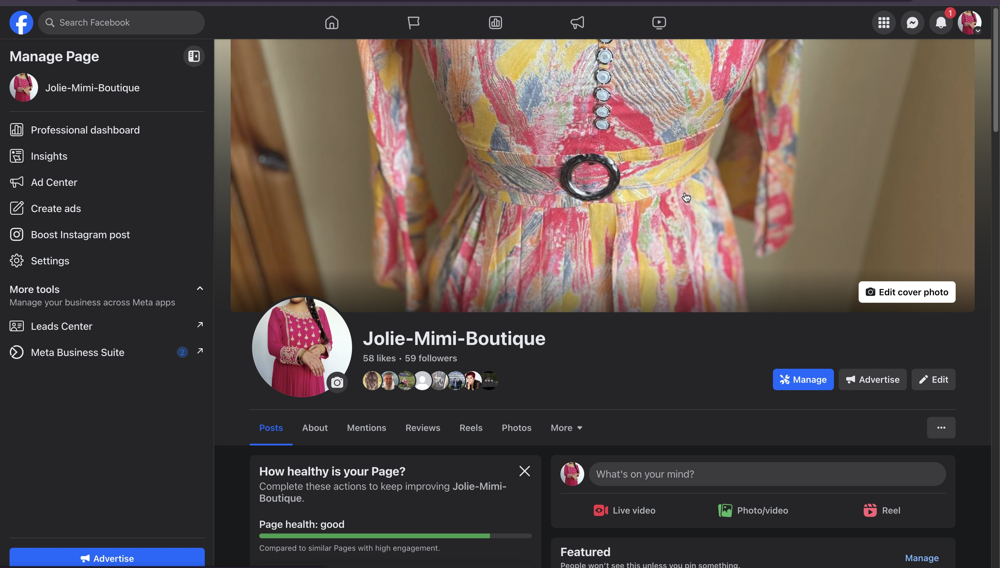
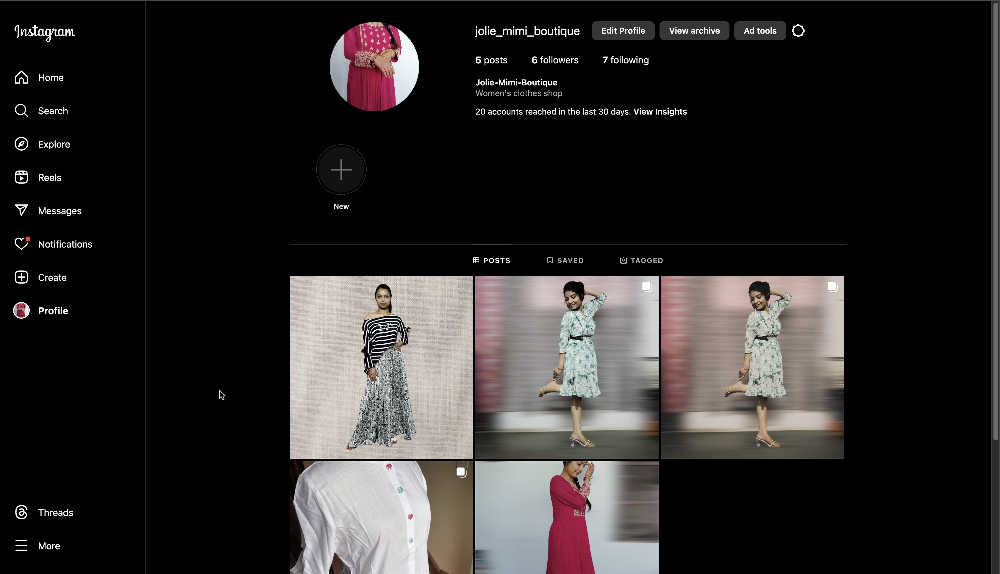

# [Jolie Mimi Boutique](https://jolie-mimi-boutique-ad3e13f83c61.herokuapp.com/)
<div align="center">
 
</div>

## About
 [Jolie Mimi Boutique](https://jolie-mimi-boutique-ad3e13f83c61.herokuapp.com/)is an ecommerce platfom as a ladies' boutique, dealing with the latest, chick and trendy clothes alongside some jewellery items, developed on Django. It encompasses user registration, profile management, newsletter subscriptions, and product purchases facilitated by Stripe. Users of Jolie Mimi Boutique can submit their reviews about the products they have bought or want to buy. Frontend admin controls empower easy management of products and users. In addition, the website has a functionality that is a live chat, this live chat can be controlled by the shop owner/staff and could be limited to one or more staff depending on the average number of customers serving. Via this chat facility customer can interact with the customer care/sales staff to get instant help before buying any product or service provided by the website.

---

# E-commerce website

**Deployed website: [Link to website](https://jolie-mimi-boutique-ad3e13f83c61.herokuapp.com/)**




**Card number for payment testing: 4242424242424242**
 

## Table of Contents
1. <details open>
    <summary><a href="#ux">UX</a></summary>

    <ul>
    <li><details>
    <summary><a href="#goals">Goals</a></summary>

    - [Visitor Goals](#visitor-goals)
    - [Business Goals](#business-goals)
    - [User Stories](#user-stories)
    </details></li>

    <li><details>
    <summary><a href="#visual-design">Visual Design</a></summary>

    - [Wireframes](#wireframes)
    - [Fonts](#fonts)
    - [Colors](#colors)
    </details></li>

     <li><details>
    <summary><a href="#agile-development">Agile Development</a></summary>

    - [Milestones](#project-milestones)
    - [Progression](#project-progression)
    </details></li>

    </ul>
</details>

2. <details open>
    <summary><a href="#features">Features</a></summary>

    <ul>
    <li><details>
    <summary><a href="#site-pages">Site Pages</a></summary>

    - [Homepage](#homepage)
    - [Newsletter Subscription Popup](#newsletter-subscription-popup)
    - [Footer](#footer)
    - [Product List](#product-list)
    - [Product Detail](#product-detail)
    - [Contact Page](#contact-page)
    - [FAQ Page](#faq-page)
    - [Profile Page](#profile-page)
    - [Cart Page](#cart-page)
    - [Toasts Including Bag Preview](#toasts-including-bag-preview)
    - [Product Management](#product-management)
    - [Checkout](#checkout)
    - [Checkout Success](#checkout-success)
    - [Authentication Pages](#authentication-pages)    
    </details></li>

    <li>
    <a href="#features-not-yet-implemented">Features Not Yet Implemented</a>
    </li>
    </ul>
</details>

3. <summary><a href="#technologies-used">Technologies Used</a></summary>

4. <summary><a href="#webhooks">Webhooks</a></summary>

5. <summary><a href="#database-design">Database Design</a></summary>

6. <summary><a href="#ecommerce-business-model">Ecommerce Business Model</a></summary>

7. <summary><a href="#search-engine-optimization-and-social-media-marketing">Search Engine Optimization And Social Media Marketing
</a></summary>

8. <summary><a href="#testing">Testing</a></summary>

9. <a href="#deployment">Deployment</a>

10. <a href="#credits-and-acknowledgements">Credits and Acknowledgements</a>

----

# UX

The website was created to be eye-catching and user-friendly. The user is given plenty of choices to choose from when they are shopping. The emphasis is on the user experience; the user can navigate the website easily to fulfill users' goals. The website is designed to be easy to use and easy to understand. Additionally, the website attracts customers to become a part of loyalty programs by giving them additional discounts on their purchases.
It also handles all personnel functionality moving from admin to manager to logistics to other personnel.
Business goals were to make the website as scalable as possible and reusable in the real world so that the store personnel could use it according to their position in the company.

## Goals
### Visitor Goals

Target Audience (Two different cultures):

Our online boutique, where elegance meets empowerment! We pride ourselves on offering a curated selection of the latest fashion trends to make every woman feel confident and stylish. From chic dresses perfect for a night out to sophisticated workwear that commands attention, our collection caters to ladies and young girls who seek to express their unique personalities through fashion. Our easy-to-navigate website ensures a delightful shopping experience from the comfort of your home, where you can explore, browse, and discover pieces that resonate with your style. Join us online, where fashion dreams come true and every outfit tells your story. This website may hold many products, and it is essential to make sure that the website is easy to use and navigate. It is also a platform where two cultures join together which means not only Western but even Indian clothes can also be purchased from the same website.
 
User Goals:

- Find and purchase top-quality fabric, latest, trendy, chic, dresses and jewellery.
- Easy checkout, safe & secure payment payment option. 
- Stay informed about the latest trends, tips, and news in the fashion industry.
- Easily navigate the website to discover relevant products and content.
- Customize their profiles and engage with other customers through recommendations, reviews, and likes


### Business Goals

- Develop a dynamic and interactive e-commerce platform that offers a seamless shopping experience for women of all ages, emphasizing convenience and quality.
-Drive consistent traffic by providing engaging features beyond product listings, such as interactive forums and customer care resources, fostering a thriving online community.
- Maintain a regular cadence of product updates and promotions to keep users engaged and coming back for new offerings.
- Establish Jolie Mimi Boutique as a trusted authority in the fashion industry by curating and showcasing only high-quality products from reputable brands, ensuring customer satisfaction and loyalty.
- Implement strategies to highlight top-selling products, user favorites, and exclusive deals, driving sales and potentially attracting partnerships with leading garments suppliers or brands.

### User Stories

All user stories can be found in the linked GitHub project [here](https://github.com/users/Mr-KulwinderSingh/projects/8)

## Visual Design
### Wireframes

All wireframes can be found via this link to the GitHub folder [here](https://github.com/Mr-KulwinderSingh/jolie_mimi_boutique/tree/main/readme-images/wireframes)

### Fonts

- **Logo:** 
**[Nunito](https://fonts.google.com/specimen/Nunito?query=Nunito):** Nunito is an impactful display font that adds a rebellious vibe to an e-commerce platform. With its simple & clear appearance, Nunito commands smoothness and makes a clear statement, perfect for conveying a sense of activism or boldness in the design. Its distinct letterforms and unique style give to the project a standout aesthetic, while still maintaining legibility for titles and description.

**[Jaini](https://fonts.google.com/?preview.text=Jolie-Mimi-Boutique&query=Jaini):** Jaini is a font that can suit any type of logo, but its unique and mixed italic style makes the name Jolie Mimi Boutique look more elegant and clear, adding to its sophistication. 
Both Protest Strike and Dancing Script were used for my logo - they excellently contrast each other. 

**[Sans-serif]** Choosing sans-serif as the backup ensures universal legibility,especially on screens and digital platforms. Sans-serif fonts are known for their clarity and readability, making them a reliable fallback option in case any issues arise with the primary or secondary font choices. I also used cursive as the backup font for Dancing Script in the logo. 


### Colors

<div align="center">
 
</div>

In crafting the color palette for this project, I aimed to strike a perfect balance between vibrancy, clarity, and visual appeal. Let's delve into why each color was carefully chosen:

- **Off Pink (#e12656) for the Logo**: Off Pink, kind a fushia colour is a bit unique and girlish colour which suits the best for our ladies' fashion boutique, being a classic and glossy look provides a strong combination of our logo and the delivery banner and follow the line down to shop now button. Its timeless appeal ensures that our brand identity stands out boldly against lighter backgrounds, guaranteeing excellent readability and visibility. Plus, base pink exudes professionalism and sophistication, aligning perfectly with our brand's ethos.
    
- **White (#FFFFFF) for the Background**: White serves as the canvas upon which all other colors and content come to life. Its clean and neutral nature creates a sense of spaciousness and cleanliness, enhancing readability and user experience. A white background exudes simplicity and elegance, perfectly complementing various design styles.
    
- **Yellow (#ffc107) for Buttons, messages background**: #ffc107 is a darker shade of yellow. It carries a rich and deep tone that exudes sophistication and depth. This color combines the vibrancy of yellow with the calming qualities, resulting in a hue that is both bold and grounded.
    

In essence, our color palette embodies simplicity and vibrancy, creating a visually appealing and user-friendly experience. The combination of classic pink, pristine white, and lively yellow forms a cohesive design that effectively communicates our brand's message. This palette also allows our vibrant product and brand name to shine, creating a dynamic and engaging platform for our audience.

## Agile Development

The journey of Jolie Mimi Boutique began with the establishment of a GitHub Projects Page, serving as the central hub for project management. This platform played a pivotal role in organizing tasks systematically, creating user stories, and breaking them down into actionable steps. The overarching goal was to create a structured roadmap that would guide the project towards successful completion within the designated timeframe. Utilizing the GitHub Projects Page enabled the tracking of the project's evolution, assignment of tasks, and achievement of milestones, ensuring a smooth and organized development process. The MoSCoW method, alongside customized GitHub project labels, was instrumental in assisting me in prioritizing essential tasks within the constraints of my available time.

To view the:

* project Kanban board, issues [please follow this link.](https://github.com/users/Mr-KulwinderSingh/projects/8)

### Project Milestones

The project was divided into several key milestones, each representing a significant phase in the development process. Within each milestone, epics were identified, representing broader themes or features to be implemented. These epics were further broken down into user stories, representing specific functionalities or requirements from the user's perspective. Finally, tasks were defined within each user story, representing the individual steps needed to fulfill the user story's objectives.

### Example Milestones, Epics, User Stories, and Tasks (Not Representative of the Actual Project):

1. **Milestone 1: Project Setup**
    
    - Epic 1: Repository Setup
        - User Story 1: Initialize Git repository
            - Task 1: Create repository on GitHub
            - Task 2: Clone repository locally
        - User Story 2: Setup Development Environment
            - Task 1: Install necessary dependencies
            - Task 2: Configure project settings
2. **Milestone 2: User Authentication**
    
    - Epic 2: User Registration
        - User Story 3: Allow users to register for an account
            - Task 1: Create user registration form
            - Task 2: Implement backend logic for user registration
        - User Story 4: Enable email verification for new accounts
            - Task 1: Generate verification email upon registration
            - Task 2: Implement email verification process
3. **Milestone 3: Product Management**
    
    - Epic 3: Product Listing
        - User Story 5: Display list of available products
            - Task 1: Design product listing page UI
            - Task 2: Fetch and display products from database
        - User Story 6: Implement product search functionality
            - Task 1: Create search bar component
            - Task 2: Implement search logic

### Project Progression

The project evolved iteratively, with each milestone representing a significant step forward in the development process. Tasks within each milestone were completed incrementally, with regular reviews and adjustments made to ensure alignment with project goals and user requirements.

In summary, the use of project milestones, epics, user stories, and tasks, coupled with effective project management tools like GitHub Projects and Kanban boards, facilitated a structured and organized approach to building Fetch & Feast.


## Features

### Existing Features

### Site Pages

- ### Homepage

- **Navigation Bar:**
    - The navigation bar serves as a central hub for accessing key features and navigating the site.
    - **Logo:**
        - Positioned prominently on the left side of the navigation bar, the logo serves as a visual anchor, reinforcing brand identity.
    - **Search Bar:**
        - Located prominently within the navigation bar, the search bar allows users to quickly find specific products or content.
    - **Account Dropdown:**
        - For logged-out users, the account dropdown provides options to log in or sign up for an account.
        - Logged-in users have access to their profile, enabling them to manage their account settings, view orders, and access additional features.
        - Superusers have additional options for product management, allowing them to oversee content creation and updates.
    - **Main Navigation:**
        - Positioned below the account dropdown, the main navigation menu offers dropdown options for each page category, Product and More.
        - Each dropdown menu provides access to specific sections or pages related to the respective category, enhancing navigation efficiency for users.

- **Hero Image:**

    - The main homepage showcases a large, visually striking hero image that instantly grabs the user's attention. High-quality hero image shows a girl sitting on an elevator, appealing to female customers with trendy fashion clothes and jewelry. 
    - A prominent call-to-action button invites users to enter and explore the site's products.

<div align="center">
 
</div>
<div align="center">
 
 
</div>

- ### Footer
    
    - The footer section of the website offers convenient navigation and essential information for users.
    - **Contact Us:**
        - Includes links to the contact page and FAQ section, providing users with quick access to assistance and support.
        - **FAQs :**
        This link leads to the FAQ section, providing users with quick access to answers of Frequently Asked Questions.
    - **My Account Column:**
        - For logged-out users, this column features options to log in or sign up for an account.
        - Logged-in users have access to their profile, allowing them to manage their account settings, and sign out if needed.
        - Superusers have additional options for product management, enabling them to oversee content creation and updates.
    - **Contact Info:**
        - Includes essential contact details are the most important links for the customers, for their convenience most appropriate contact link is whatsapp, through this they can be redirected to WhatsApp on their mobile phone and chat about the product & services, real link has been given through the site. Next to this is email the for the customers who want to be contacted via email. Telephone number is next in the list and last link address with the google map. Contact details such as phone number, email address, and location, ensure users can reach out for assistance or inquiries. 
    - **Social Media and Legal Links:**
        - Features a link to the site's Facebook page, facilitating social media engagement and community interaction.
        - Includes copyright information and a link to the privacy policy, ensuring compliance with legal requirements and providing transparency to users regarding data usage and privacy practices.

<div align="center">
 
</div>

- Mobile

<div align="center">
 
</div>


- ### Product List
    - The product list feature provides users with a straightforward and intuitive way to browse through available products.
    - **Display Format:**
        - Products are presented in individual cards, each containing essential information such as the product image, name, rating, reviews,selling price, (discounted price, for future development) and category.
        - For superusers, additional options to edit/update and delete products are available directly within the product cards.
    - **Pagination:**
        - To enhance usability and manageability, the product list displays a maximum of 4 products in a row and scroll-down button can show all of them.
        - If user wants to go back and have a look at particular one which was at the top row of the page, He can use the 'Back to Top' button, which is located at the bottom right corner of the page.

<div align="center">
 
</div>
<div align="center">
 
</div>

- ### Product Detail
    - The product detail section on the product page provides users with comprehensive information about the selected product.
    - **Content Displayed:**
        - Product Name: Clearly identifies the product for users.
        - Price: Displays the price of the product, allowing users to make informed purchasing decisions.
        - Average Rating: Shows the average rating of the product based on user reviews from the ratings model, providing social proof and credibility.
        - Category: Indicates the category to which the product belongs, aiding users in navigation and organization.
        - Edit/Delete Links (for Superusers): Allows superusers to perform administrative actions such as editing or deleting the product directly from the product detail page.
        - Product Description: Provides a detailed description of the product, highlighting its features and benefits.
        - Quantity Selector: Enables users to select the desired quantity of the product before adding it to their shopping bag.
        - "Keep Shopping" Button: Offers users the option to continue browsing other products without leaving the current page.
        - "Add to Bag" Button: Allows users to add the selected quantity of the product to their shopping bag, initiating the checkout process.
    - **Product Image:**
        - The product image is prominently displayed within the product detail section.
        - A simple Bootstrap popup modal is implemented to allow users to view a larger version of the product image if desired, enhancing the user experience by providing a closer look at the product.

<div align="center">
 
</div>

- ### Reviews

    - The `product_detail` view renders the reviews.
    - Reviews for the products are retrieved from the database and paginated for easy navigation.
    - Users can submit a review of the product by using a very easy form, with validation to ensure proper input.
    - A check is performed to determine if the current user has an account, allowing only verified account holders to submit reviews.
    - Profile names of users who submitted reviews are displayed alongside the date and stars, enhancing the credibility of the ratings and reviews.
    - Superusers can edit or delete individual reviews/ratings through dedicated updated reviews.
.

<div align="center">
 
</div>


## Technologies used
- ### Languages:
    
    + [python-3.9.16](https://www.python.org/downloads/release/python-385/): the primary language used to develop the server-side of the website.
    + [JS](https://www.javascript.com/): the primary language used to develop interactive components of the website.
    + [HTML](https://developer.mozilla.org/en-US/docs/Web/HTML): the markup language used to create the website.
    + [CSS](https://developer.mozilla.org/en-US/docs/Web/css): the styling language used to style the website.

- ### Frameworks and libraries:

    + [Django](https://www.djangoproject.com/): python framework used to create all the logic.
    + [jQuery](https://jquery.com/): was used to control click events and sending AJAX requests.
    + [jQuery User Interface](https://jqueryui.com/) was used to create interactive elements.

- ### Databases:

    + [SQLite](https://www.sqlite.org/): was used as a development database.
    + [PostgreSQL](https://www.postgresql.org/): the database used to store all the data.


- ### Other tools:

    + [Git](https://git-scm.com/): the version control system used to manage the code.
    + [Pip3](https://pypi.org/project/pip/): the package manager used to install the dependencies.
    + [Gunicorn](https://gunicorn.org/): the web server used to run the website.
    + [Psycopg2](https://www.psycopg.org/): the database driver used to connect to the database.
    + [Django-allauth](https://django-allauth.readthedocs.io/en/latest/): the authentication library used to create the user accounts.
    + [Django-crispy-forms](https://django-cryptography.readthedocs.io/en/latest/): was used to control the rendering behavior of Django forms.
    + [Render](https://pypi.org/project/render/): was used to render the README file.
    + [GitHub](https://github.com/): used to host the website's source code.
    + [VSCode](https://code.visualstudio.com/): the IDE used to develop the website.
    + [Chrome DevTools](https://developer.chrome.com/docs/devtools/open/): was used to debug the website.
    + [Font Awesome](https://fontawesome.com/): was used to create the icons used in the website.
    + [Draw.io](https://www.lucidchart.com/) was used to make a flowchart for the README file.
    + [Color-hex](https://www.color-hex.com/) was used to make a colour palette for the website.
    + [Photoroom](https://www.photoroom.com/) was used to edit and change the background of all the pictures, all pictures are real and taken with Redmi 12 5g mobile. 3 pictures are downloaded from google.
    + [BGJar](https://www.bgjar.com/): was used to make a background images for the website.
    + [W3C Validator](https://validator.w3.org/): was used to validate HTML5 code for the website.
    + [W3C CSS validator](https://jigsaw.w3.org/css-validator/): was used to validate CSS code for the website.
    + [JShint](https://jshint.com/): was used to validate JS code for the website.
    + [PEP8](https://pep8.org/): was used to validate Python code for the website.
    + [geonames](https://www.geonames.org/) was used to get the country and city names.
    + [Multiple Video & Image Upload Plugin - jQuery Miv.js](https://www.jqueryscript.net/form/multi-video-image-upload.html) was used to upload multiple videos and images. **Note:** the plugin  is using special characters in css and js files that I am aware about!
    + [stripe](https://stripe.com/): was used to create the payment system.
    + [birme.net](https://www.birme.net/): was used to crop and center unsplash images.
    + [Sitemap Generator](https://www.xml-sitemaps.com/) was used to create the sitemap.xml file.
    + [Privacy Policy Generator](https://www.privacypolicygenerator.info/) was used to create the privacy policy.
    + [Django-extensions](https://django-extensions.readthedocs.io/en/latest/) was used to create a Entity-Relationship Diagram.

# Webhooks
    
- The site uses a secure and robust webhook system to ensure that the payment process cannot be interrupted and corrupted, either through user error or malicious intent. Webhooks are incorporated via the Stripe payment system and are handled on the Stripe website, by way of the python code in `checkout > webhook_handler.py` and `checkout > webhooks.py`

<div align="center">
 
</div>


# Database Design

<div align="center">
 
</div>

1. **User (allauth)**:
    
    - This model represents a user account and is likely provided by Django's authentication system (allauth).
    - It serves as a base user model and is referenced by other models through foreign keys (FK), such as UserProfile, NewsletterSubscription, Order, Rating, and Comment.

2. **UserProfile**:
    
    - This model stores additional information about each user.
    - It has a one-to-one relationship with the User model, meaning each UserProfile instance is associated with exactly one User instance.
    - It contains fields like default\_email, default\_phone\_number, default\_street\_address1, etc., to store user-specific information.

3. **Product**:
    
    - This model represents a product available on the platform.
    - It has a foreign key (FK) relationship with the Category model, indicating that each product belongs to a specific category.
    - It's referenced by the OrderLineItem model through a foreign key, indicating that each order line item is associated with a specific product.

4. **Wishlist**:
    
    - This model represents a user who can show his/her interest in a product and can save to buy it later.
    - It has a one-to-one field relationship with the User model, indicating that each user is associated with a specific user's profile
    
5. **WishListItem**:
    
    - This model represents a line item within the Wishlist.
    - It has foreign key (FK) relationships with both the Wishlist and Product models, indicating the wishlist item belongs to that product is being saved.

6. **Order**:
    
    - This model represents an order placed by a user.
    - It has a foreign key (FK) relationship with the UserProfile model, indicating that each order is associated with a specific user's profile.
    - It's referenced by the OrderLineItem model through a foreign key, indicating that each order line item is associated with a specific order.

7. **ProductReview**:
    
    - This model represents a rating given by a user to a product.
    - It has foreign key (FK) relationships with both the Product and User models, indicating the product being reviewed and the user who gave the reviews.

8. **OrderLineItem**:
    
    - This model represents a line item within an order.
    - It has foreign key (FK) relationships with both the Order and Product models, indicating the order the line item belongs to and the product being ordered.
9. **Category**:
    
    - This model represents a category for products.
    - It's referenced by the Product model through a foreign key, indicating that each product belongs to a specific category.


# Ecommerce Business Model

1. **Business Type**: Business to Customer (B2C)
    
2. **Nature of Business**: Jolie Mimi Boutique operates as an e-commerce platform that sells ladies' fashion clothes and jewellery items to individual customers.
    
3. **Revenue Streams**:
    
    - Sales Revenue: Generated through the direct sale of clothes and jewellery items to customers.
    - Advertising Revenue: Potential income from sponsored content or advertisements displayed on the website.
   
4. **Customer Segments**:
    
    - Teenage customers: Individuals which are interested in purchasing quality fabric and latest trendy clothes from a reliable source.
    - All ages(above teenage): All other customers who know where you get from basic to high cost and for all types of occasions clothes and jewellery.
    - Asian Females: We are not only dealing with western culture oriented clothes and jewellery even we serve our asian community as well by selling their cultural dresses and some unstitched variety clothes.  

5. **Value Proposition**:
    
    - Quality Products: We offer a wide range of high-quality garments and jewelry sourced from reputable suppliers in India. They are not only suppliers but also manufacturers, so we can rely on the quality of the garments.
    - Convenience: Providing a convenient online platform for customers to browse, purchase, and receive products without leaving their homes.
    - Community Engagement: Building a community of trend lovers through social media engagement, fostering a sense of belonging and loyalty.

6. **Channels**:
    
    - E-commerce Website: The primary platform for showcasing products, processing orders, and facilitating transactions.
    - Social Media: Utilizing platforms such as Facebook & Instagram for marketing, customer engagement, and community building.
    - Newsletter: Sending regular updates, promotions, and announcements to subscribers via email.

7. **Customer Relationships**:
    
    - Personalized Support: Offering responsive customer support to address inquiries, provide assistance, and resolve issues promptly.
    - Engagement: Actively engaging with customers through social media interactions, responding to comments, and sharing user-generated content.

8. **Key Activities**:
    
    - Product Sourcing: Identifying and sourcing high-quality fabric and artificial jewellery from trusted suppliers and manufacturers.
    - Website Management: Maintaining and updating the e-commerce platform to ensure a seamless shopping experience for customers.
    - Marketing and Promotion: Implementing marketing strategies to attract new customers, retain existing ones, and promote brand awareness.

9. **Key Resources**:
    
    - Product Inventory: Stocking a diverse range of ladies' garments, related accessories and some jewellery items to meet customer demand.
    - E-commerce Platform: Investing in a robust and user-friendly website for online sales and transactions.
    - Social Media Presence: Building and maintaining an active presence on social media platforms to engage with customers and drive traffic to the website.

10. **Cost Structure**:
    
    - Product Costs: Expenses related to sourcing, purchasing, and stocking inventory.
    - Website Maintenance: Costs associated with hosting, domain registration, website development, and maintenance.
    - Marketing Expenses: Budget allocated for advertising, promotions, and social media marketing campaigns.

11. **Key Partnerships**:
    
    - Suppliers: Establishing partnerships with reliable suppliers and manufacturers to ensure a consistent supply of quality products.
    - Delivery Services: Collaborating with shipping and delivery services to fulfill customer orders efficiently and reliably.
    - Influencers and Affiliates: Partnering with pet influencers or affiliates to promote products and reach a wider audience.

12. **Growth Strategies**:
    
    - Expansion of Product Range: Continuously adding new and innovative products to cater to evolving customer preferences and trends.
    - Geographic Expansion: Scaling operations to reach new geographic markets and expand the customer base.
    - Customer Loyalty Programs: Implementing loyalty programs, discounts, and rewards to incentivize repeat purchases and customer loyalty.


<hr>


# Search Engine Optimization And Social Media Marketing

Newsletters / Subscrition were implemented in the email_notification. The manager can create a newsletter and send it to all customers. Offers and discounts all can be advertised and introduced via newsletters. It also handles sending newsletters about new loyalty programs with promo codes(Futue development).

1. News Letter/ Subscribtion

To send a newsletter to all customers, the manager can create a newsletter and send it to all customers.
I have used Django EmailMultiAlternatives to send the newsletter.


2. Discounts and offers

To send a newsletter about new loyalty programs, offers, and discounts to all customers, the manager/admin can create a newsletter using the same form with a promo code field filled with a legend. Django EmailMultiAlternatives is also responsible for it.

<hr>


3. Facebook

Facebook is essential for the store to be able to reach customers. According to the statistics, the store has a good reach among people who prefer to use Facebook. Facebook has excellent coverage worldwide among people who can purchase products online.

"Jolie Mimi Boutique" Facebook page is for marketing purposes to post adverts and exciting content and engage users.



Please follow the links to see more images:

[facebook-page](https://github.com/Mr-KulwinderSingh/jolie_mimi_boutique/assets/124357266/3c0ef45f-6715-4a48-b8f6-37c3c99b3f12)

[facebook-page-2](https://github.com/Mr-KulwinderSingh/jolie_mimi_boutique/assets/124357266/a1f880bc-70c8-4721-b632-3d3d911914bd)

[facebook-page-3](https://github.com/Mr-KulwinderSingh/jolie_mimi_boutique/assets/124357266/1c23a8f0-86af-4dbd-b96a-f2a0983d0068)

<hr>

4. Instagram

Instagram attracts people of younger ages and is essential for the store to be able to reach this age group. According to the statistics, 90% of Instagram users are under 35 years old. [See report](https://info.lse.ac.uk/staff/divisions/communications-division/digital-communications-team/assets/documents/guides/A-Guide-To-Social-Media-Platforms-and-Demographics.pdf)

"Jolie Mimi Boutique" Instagram page is for marketing purposes to post adverts, interesting content, and engage users.



<hr>

### Sitemap Generation with XML-Sitemaps

To streamline the process of creating a sitemap.xml file for my website, I utilized [XML-Sitemaps.](https://www.xml-sitemaps.com/)

By submitting the deployed site URL ([https://jolie-mimi-boutique-ad3e13f83c61.herokuapp.com/](https://jolie-mimi-boutique-ad3e13f83c61.herokuapp.com/)), the tool meticulously crawled through the entire site. Following the completion of this process, it automatically generated a detailed sitemap.xml document. I subsequently downloaded this file and added it into the repository.


# Testing

For all testing, please refer to the [TESTING.md]() file.

# Deployment

The live deployed application can be found deployed on [Heroku](https://github.com/Mr-KulwinderSingh/jolie_mimi_boutique).

### ElephantSQL Database

This project uses [ElephantSQL](https://www.elephantsql.com/) for the PostgreSQL Database.

To obtain your own Postgres Database, sign-up with your GitHub account, then follow these steps:

- Click **Create New Instance** to start a new database.
- Provide a name (this is commonly the name of the project: fetch-and-feast).
- Select the **Tiny Turtle (Free)** plan.
- You can leave the **Tags** blank.
- Select the **Region** and **Data Center** closest to you.
- Once created, click on the new database name, where you can view the database URL and Password.

### Amazon AWS

This project uses [AWS](https://aws.amazon.com/) to store media and static files online, due to the fact that Heroku doesn't persist this type of data.

Once you've created an AWS account and logged-in, follow these series of steps to get your project connected. Make sure you're on the **AWS Management Console** page.

#### S3 Bucket

- Search for **S3**.
    
- Create a new bucket, give it a name (matching your Heroku app name), and choose the region closest to you.
    
- Uncheck **Block all public access**, and acknowledge that the bucket will be public (required for it to work on Heroku).
    
- From **Object Ownership**, make sure to have **ACLs enabled**, and **Bucket owner preferred** selected.
    
- From the **Properties** tab, turn on static website hosting, and type `index.html` and `error.html` in their respective fields, then click **Save**.
    
- From the **Permissions** tab, paste in the following CORS configuration:
    
    ```shell
     [
     	{
     		"AllowedHeaders": [
     			"Authorization"
     		],
     		"AllowedMethods": [
     			"GET"
     		],
     		"AllowedOrigins": [
     			"*"
     		],
     		"ExposeHeaders": []
     	}
     ]
    ```
    
- Copy your **ARN** string.
    
- From the **Bucket Policy** tab, select the **Policy Generator** link, and use the following steps:
    
    - Policy Type: **S3 Bucket Policy**
        
    - Effect: **Allow**
        
    - Principal: `*`
        
    - Actions: **GetObject**
        
    - Amazon Resource Name (ARN): **paste-your-ARN-here**
        
    - Click **Add Statement**
        
    - Click **Generate Policy**
        
    - Copy the entire Policy, and paste it into the **Bucket Policy Editor**
        
        ```shell
         {
         	"Id": "Policy1234567890",
         	"Version": "2012-10-17",
         	"Statement": [
         		{
         			"Sid": "Stmt1234567890",
         			"Action": [
         				"s3:GetObject"
         			],
         			"Effect": "Allow",
         			"Resource": "arn:aws:s3:::your-bucket-name/*"
         			"Principal": "*",
         		}
         	]
         }
        ```
        
    - Before you click "Save", add `/*` to the end of the Resource key in the Bucket Policy Editor (like above).
        
    - Click **Save**.
        
- From the **Access Control List (ACL)** section, click "Edit" and enable **List** for **Everyone (public access)**, and accept the warning box.
    
    - If the edit button is disabled, you need to change the **Object Ownership** section above to **ACLs enabled** (mentioned above).


### Heroku Deployment

This project uses [Heroku](https://www.heroku.com/), a platform as a service (PaaS) that enables developers to build, run, and operate applications entirely in the cloud.

Deployment steps are as follows, after account setup:

- Select **New** in the top-right corner of your Heroku Dashboard, and select **Create new app** from the dropdown menu.
- Your app name must be unique, and then choose a region closest to you (EU or USA), and finally, select **Create App**.
- From the new app **Settings**, click **Reveal Config Vars**, and set your environment variables.

| Key | Value |
| --- | --- |
| `AWS_ACCESS_KEY_ID` | user's own value |
| `AWS_SECRET_ACCESS_KEY` | user's own value |
| `DATABASE_URL` | user's own value |
| `DISABLE_COLLECTSTATIC` | 1 (_this is temporary, and can be removed for the final deployment_) |
| `EMAIL_HOST_PASS` | user's own value |
| `EMAIL_HOST_USER` | user's own value |
| `SECRET_KEY` | user's own value |
| `STRIPE_PUBLIC_KEY` | user's own value |
| `STRIPE_SECRET_KEY` | user's own value |
| `STRIPE_WH_SECRET` | user's own value |
| `USE_AWS` | True |

Heroku needs two additional files in order to deploy properly.

- requirements.txt
- Procfile

You can install this project's **requirements** (where applicable) using:

- `pip3 install -r requirements.txt`

If you have your own packages that have been installed, then the requirements file needs updated using:

- `pip3 freeze --local > requirements.txt`

The **Procfile** can be created with the following command:

- `echo web: gunicorn app_name.wsgi > Procfile`
- _replace **app\_name** with the name of your primary Django app name; the folder where settings.py is located_

For Heroku deployment, follow these steps to connect your own GitHub repository to the newly created app:

Either:

- Select **Automatic Deployment** from the Heroku app.

Or:

- In the Terminal/CLI, connect to Heroku using this command: `heroku login -i`
- Set the remote for Heroku: `heroku git:remote -a app_name` (replace _app\_name_ with your app name)
- After performing the standard Git `add`, `commit`, and `push` to GitHub, you can now type:
    - `git push heroku main`

The project should now be connected and deployed to Heroku!

### Local Deployment

This project can be cloned or forked in order to make a local copy on your own system.

For either method, you will need to install any applicable packages found within the _requirements.txt_ file.

- `pip3 install -r requirements.txt`.

You will need to create a new file called `env.py` at the root-level, and include the same environment variables listed above from the Heroku deployment steps.

Sample `env.py` file:

```python
import os

os.environ.setdefault("AWS_ACCESS_KEY_ID", "user's own value")
os.environ.setdefault("AWS_SECRET_ACCESS_KEY", "user's own value")
os.environ.setdefault("DATABASE_URL", "user's own value")
os.environ.setdefault("EMAIL_HOST_PASS", "user's own value")
os.environ.setdefault("EMAIL_HOST_USER", "user's own value")
os.environ.setdefault("SECRET_KEY", "user's own value")
os.environ.setdefault("STRIPE_PUBLIC_KEY", "user's own value")
os.environ.setdefault("STRIPE_SECRET_KEY", "user's own value")
os.environ.setdefault("STRIPE_WH_SECRET", "user's own value")

# local environment only (do not include these in production/deployment!)
os.environ.setdefault("DEBUG", "True")
```

Once the project is cloned or forked, in order to run it locally, you'll need to follow these steps:

- Start the Django app: `python3 manage.py runserver`
- Stop the app once it's loaded: `CTRL+C` or `⌘+C` (Mac)
- Make any necessary migrations: `python3 manage.py makemigrations`
- Migrate the data to the database: `python3 manage.py migrate`
- Create a superuser: `python3 manage.py createsuperuser`
- Load fixtures (if applicable): `python3 manage.py loaddata file-name.json` (repeat for each file)
- Everything should be ready now, so run the Django app again: `python3 manage.py runserver`

If you'd like to backup your database models, use the following command for each model you'd like to create a fixture for:

- `python3 manage.py dumpdata your-model > your-model.json`
- _repeat this action for each model you wish to backup_

#### Cloning

You can clone the repository by following these steps:

1. Go to the [GitHub repository](https://jolie-mimi-boutique-ad3e13f83c61.herokuapp.com/)
2. Locate the Code button above the list of files and click it
3. Select if you prefer to clone using HTTPS, SSH, or GitHub CLI and click the copy button to copy the URL to your clipboard
4. Open Git Bash or Terminal
5. Change the current working directory to the one where you want the cloned directory
6. In your IDE Terminal, type the following command to clone my repository:
    - `git clone https://github.com/Mr-KulwinderSingh/jolie_mimi_boutique` 
7. Press Enter to create your local clone.

Alternatively, if using Gitpod, you can click below to create your own workspace using this repository.

[](https://gitpod.io/new#https://github.com/Mr-KulwinderSingh/jolie_mimi_boutique)

Please note that in order to directly open the project in Gitpod, you need to have the browser extension installed. A tutorial on how to do that can be found [here](https://www.gitpod.io/docs/configure/user-settings/browser-extension).

#### Forking

By forking the GitHub Repository, we make a copy of the original repository on our GitHub account to view and/or make changes without affecting the original owner's repository. You can fork this repository by using the following steps:

1. Log in to GitHub and locate the [GitHub Repository](https://github.com/leec313/Fetch-and-Feast)
2. At the top of the Repository (not top of page) just above the "Settings" Button on the menu, locate the "Fork" Button.
3. Once clicked, you should now have a copy of the original repository in your own GitHub account!

# Credits and Acknowledgements

## Content and Resources

- **Images**: Redmi12 5g phone has been used to generate the majority of product images and a significant portion of facebook business page images. Additionally, I utilized personal photographs as well as images contributed by my friends and relatives.

- **Bootstrap Documentation Exploration**: I extensively referred to the Bootstrap documentation to strategize my design approach. The examples provided on getbootstrap.com proved invaluable in understanding how to effectively implement Bootstrap components. [Link to Bootstrap Documentation](https://getbootstrap.com/docs/5.0/getting-started/introduction/)
    
- **Django Documentation Consultation**: I delved into the Django documentation on multiple occasions, particularly when tackling model implementation and other content-related aspects. I feel that I haven't even gathered the basic knowledge about it, it's part of the learning and educating anyways.
    
- **W3 Schools Reference**: W3 Schools served as a reliable reference throughout the project, offering straightforward CSS examples that were instrumental in various design aspects.
    
- **Code Institute Contribution**:
    
    - The course content for Portfolio Project 5 from Code Institute played a pivotal role in equipping me with the knowledge and skills necessary to complete this project successfully.
    - The structured and comprehensive nature of the course content significantly aided my understanding of project requirements and the Django framework.
    - **Informative and Well-Paced Walkthroughs**:
        - The walkthroughs provided in the course were not only informative but also well-paced, allowing for a step-by-step understanding of concepts and implementation details.
        - The clarity of these walkthroughs facilitated the comprehension of complex topics and reinforced a strong foundation in Django development.
    - **Initial Structure Inspired by CI Walkthrough**:
        - In the project's early stages, I heavily relied on the Code Institute (CI) walkthrough for guidance.
        - The initial project structure drew influence from the CI walkthrough, serving as a scaffold until I acquired a deeper understanding of the Django framework and could confidently make personalized modifications.

## Acknowledgements

I'd like to extend my heartfelt gratitude to the remarkable team at Code Institute, especially my mentor Iuliia Konovalova and her continuous support throughout my final project of the course. Her guidance and encouragement played a pivotal role in helping me overcome challenges and ultimately succeed.

A sincere thank you goes out to all the tutors and fellow students at Code Institute. The collaborative and supportive environment they fostered created an optimal setting for learning. Their shared insights, experiences, and camaraderie greatly enhanced my journey, making it a truly memorable and fulfilling experience.